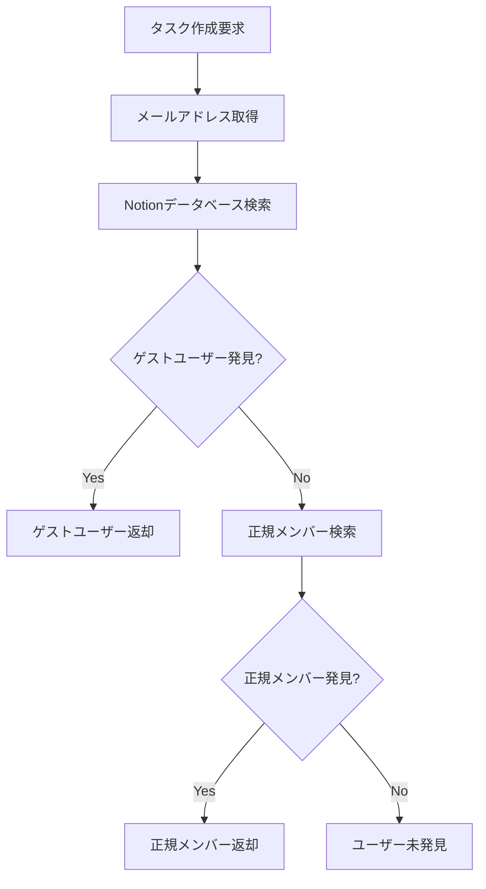

# 🔄 動的ユーザーマッピングシステム

このドキュメントでは、新しい動的ユーザーマッピングシステムについて説明します。このシステムにより、マッピングファイルの事前準備なしに、リアルタイムでNotionユーザーを検索・特定できます。

## 🎯 システム概要

### 従来の問題点
- **マッピングファイルの手動管理**: `.user_mapping.json` を手動で作成・更新
- **ゲストユーザーの取得困難**: Notion API の `users.list()` ではゲストユーザーを取得不可
- **新規ユーザー対応の遅延**: 新しいユーザーが参加する度に手動更新が必要

### 新システムの解決策
- **リアルタイム動的検索**: タスク作成時にNotionデータベースから直接検索
- **ゲストユーザー自動発見**: Peopleプロパティから全ユーザーを抽出
- **自動信頼度判定**: メール一致度に基づく自動マッピング

## 🏗️ アーキテクチャ

### DDD/オニオンアーキテクチャ
```
┌─────────────────────────────────────┐
│           Presentation              │  SlackエンドポイントAPI
├─────────────────────────────────────┤
│           Application               │  UserMappingApplicationService
├─────────────────────────────────────┤
│             Domain                  │  NotionUser, SlackUser, UserMapping
│                                     │  UserMappingDomainService
├─────────────────────────────────────┤
│          Infrastructure             │  NotionUserRepositoryImpl
│                                     │  SlackUserRepositoryImpl
└─────────────────────────────────────┘
```

### 主要コンポーネント

#### ドメイン層
- **エンティティ**: `NotionUser`, `SlackUser`, `UserMapping`
- **バリューオブジェクト**: `Email`, `NotionUserId`, `SlackUserId`
- **ドメインサービス**: `UserMappingDomainService`

#### アプリケーション層
- **アプリケーションサービス**: `UserMappingApplicationService`
- **リポジトリインターフェース**: `NotionUserRepository`, `SlackUserRepository`

#### インフラ層
- **リポジトリ実装**: `NotionUserRepositoryImpl`, `SlackUserRepositoryImpl`
- **Notionサービス**: `DynamicNotionService`

## 🔍 ユーザー検索フロー

### 1. 多段階検索戦略


### 2. 信頼度ベース判定
- **完全一致** (信頼度 1.0): メールアドレス完全一致
- **ドメイン一致** (信頼度 0.7): 同一ドメイン内唯一ユーザー
- **名前類似** (信頼度 0.1-0.3): 名前の部分一致

## 📋 実装詳細

### NotionUserRepositoryImpl
```python
# 主要メソッド
async def find_by_email(self, email: Email) -> Optional[NotionUser]
async def search_users_in_database(self, database_id: str, email: Optional[Email] = None) -> List[NotionUser]
async def get_all_workspace_users(self) -> List[NotionUser]
```

**検索順序:**
1. データベースのPeopleプロパティから検索 (ゲストユーザー対応)
2. `users.list()` から正規メンバー検索
3. 重複除去・信頼度計算

### UserMappingDomainService
```python
# 主要メソッド
def find_best_mapping(self, slack_user: SlackUser, notion_users: List[NotionUser]) -> Optional[UserMapping]
def calculate_mapping_confidence(self, slack_user: SlackUser, notion_user: NotionUser) -> float
def should_auto_approve_mapping(self, mapping: UserMapping) -> bool
```

**マッピング戦略:**
- メール完全一致 → 自動承認
- ドメイン一致 + 唯一候補 → 中信頼度
- 複数候補 → 手動確認要求

## 🚀 使用方法

### 基本的な使用
```python
# UserMappingApplicationServiceの使用例
user_mapping_service = UserMappingApplicationService(
    notion_user_repository=notion_user_repository,
    slack_user_repository=slack_user_repository,
    mapping_domain_service=mapping_domain_service
)

# メールアドレスからNotionユーザーを動的検索
notion_user = await user_mapping_service.find_notion_user_by_email("user@example.com")

# タスク作成用にペアで取得
requester, assignee = await user_mapping_service.get_notion_user_for_task_creation(
    "requester@example.com",
    "assignee@example.com"
)
```

### DynamicNotionServiceの使用
```python
# 動的NotionサービスでタスクOOOcreate
notion_service = DynamicNotionService(
    notion_token=settings.notion_token,
    database_id=settings.notion_database_id,
    user_mapping_service=user_mapping_service
)

# タスク作成（ユーザーは自動検索）
task_id = await notion_service.create_task(
    task=task_request,
    requester_email="requester@example.com",
    assignee_email="assignee@example.com"
)
```

## 📊 パフォーマンス最適化

### 1. 検索効率化
- **早期終了**: メール完全一致時点で検索終了
- **キャッシュ活用**: 同一リクエスト内でのユーザー情報キャッシュ
- **並列検索**: 依頼者・依頼先を並列検索

### 2. Notion API最適化
- **バッチ処理**: データベース全体を一度で取得
- **フィルタリング**: 特定メール検索時の早期終了
- **重複除去**: メールアドレスベースの重複排除

## 🔒 エラーハンドリング

### 1. ユーザー未発見時
```python
# 段階的フォールバック
1. データベース検索失敗 → 正規メンバー検索
2. 正規メンバー検索失敗 → エラーログ出力
3. 詳細なトラブルシューティング情報提供
```

### 2. 権限エラー対応
```python
# Notion API権限エラー
- データベース共有設定の確認手順
- Integration招待方法の案内
- 環境変数設定の検証
```

## 🧪 テスト戦略

### 1. ユニットテスト
- ドメインサービスのマッピングロジック
- バリューオブジェクトの妥当性検証
- エンティティのビジネスルール

### 2. 統合テスト
- NotionユーザーRepositoryの実際のAPI呼び出し
- Slackユーザー情報取得
- エンドツーエンドのタスク作成フロー

### 3. パフォーマンステスト
- 大量ユーザー環境での検索速度
- 並列リクエスト処理能力
- メモリ使用量監視

## 🎛️ 設定・カスタマイズ

### 1. 信頼度しきい値調整
```python
# UserMappingDomainServiceで調整可能
EMAIL_EXACT_MATCH_CONFIDENCE = 1.0      # メール完全一致
DOMAIN_MATCH_CONFIDENCE = 0.7           # ドメイン一致
NAME_SIMILARITY_CONFIDENCE = 0.1        # 名前類似
AUTO_APPROVAL_THRESHOLD = 0.9           # 自動承認しきい値
```

### 2. 検索範囲設定
```python
# NotionUserRepositoryImplで設定
SEARCH_DATABASE_FIRST = True            # データベース優先検索
INCLUDE_WORKSPACE_USERS = True          # 正規メンバー含む
DEDUPLICATE_USERS = True                # 重複除去有効
```

## 🔍 監視・ログ

### 1. 検索ログ
```
🔍 ユーザー検索開始: user@example.com
✅ データベースで発見: John Doe (user@example.com)
📋 データベーススキャン完了: 150ページ, 25ユーザー発見
```

### 2. マッピングログ
```
✅ マッピング作成成功: {"confidence": 1.0, "source": "email_exact"}
⚠️ 低信頼度マッピング: {"confidence": 0.3, "source": "name_similarity"}
❌ マッピング作成失敗: confidence不足
```

### 3. パフォーマンスログ
```
📊 検索パフォーマンス: 2.3秒 (DB: 1.8s, API: 0.5s)
🔄 重複ユーザー削除: 30 → 25
👥 正規メンバー取得: 15人
```

## 🚧 今後の拡張予定

### 1. キャッシュシステム
- Redis/Memcachedによるユーザー情報キャッシュ
- TTL設定による自動キャッシュ無効化
- 分散キャッシュ対応

### 2. 高度なマッチング
- 機械学習による名前類似度判定
- 過去のマッピング履歴学習
- ユーザー行動パターン分析

### 3. 管理UI
- マッピング状況のWebダッシュボード
- 手動マッピング承認インターフェース
- 検索統計・パフォーマンス監視

---

このドキュメントは動的ユーザーマッピングシステムの完全なガイドです。システムの理解と効果的な活用にお役立てください。